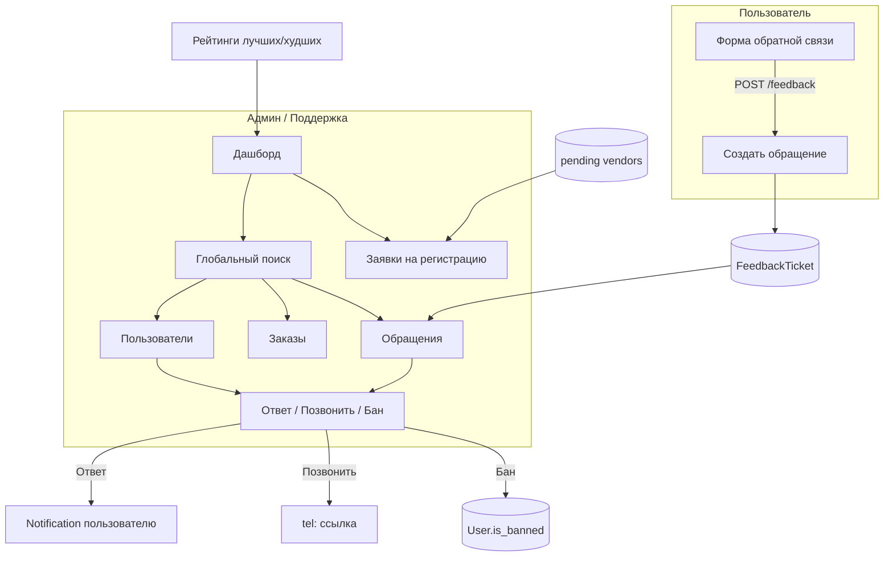

# Админ-панель для разработчиков и поддержки + обратная связь

## Текущее состояние

- **Админка:** одна страница [frontend/src/pages/Admin.tsx](frontend/src/pages/Admin.tsx) — заявки поставщиков, аналитика (заказы/выручка/по статусам), список пользователей. Нет поиска, списка заказов, отзывов, обратной связи, бана пользователей.
- **Backend admin:** [backend/app/routers/admin.py](backend/app/routers/admin.py) — users, analytics, vendors/pending, approve/reject. Нет списка заказов, поиска, сущности «обратная связь», бана пользователей.
- **Уведомления:** есть [Notification](backend/app/models/notification.py); создаются при новом отзыве для vendor. Можно переиспользовать для отправки сообщений поддержки пользователю (type `support_message`).
- **Заказы:** [backend/app/routers/orders.py](backend/app/routers/orders.py) — список только «свои» (покупатель или vendor). Для админа нужен отдельный эндпоинт «все заказы».
- **Заявки поставщиков/компаний:** уже приходят в админку через `GET /admin/vendors/pending` (User.role=vendor + Company.status=PENDING_APPROVAL). Нужно явно вынести их на дашборд и в раздел «Заявки на регистрацию».

---

## Целевая архитектура

---

## 1. Обратная связь от пользователей

### 1.1 Модель и API

- **Модель FeedbackTicket** (новая таблица `feedback_tickets`):
  - `id`, `user_id` (FK users, nullable — можно разрешить анонимные с контактом),
  - `subject` (str), `message` (text), `contact_phone` (str, nullable) — «позвоните мне»,
  - `status`: enum `open` | `in_progress` | `resolved`,
  - `admin_notes` (text, nullable) — внутренние заметки поддержки,
  - `created_at`, `updated_at`.
- **Миграция:** создание таблицы и индексов (user_id, status, created_at).

- **Публичный API (для пользователей):**
  - **POST /feedback** — создание обращения. Body: `subject`, `message`, `contact_phone?`. Авторизация: опционально (если есть user — подставляем user_id, иначе user_id=null, но тогда contact_phone обязателен для связи). Ограничение: rate limit по IP/пользователю (опционально).

- **Админский API:**
  - **GET /admin/feedback** — список обращений (query: status, limit, offset). Ответ: список с user (phone, name), subject, message, contact_phone, status, admin_notes, created_at.
  - **GET /admin/feedback/{id}** — одно обращение с деталями пользователя.
  - **PATCH /admin/feedback/{id}** — обновление status, admin_notes; опционально в теле: `send_reply` (текст) — создать уведомление пользователю (type `support_message`, payload с текстом ответа), чтобы он увидел в разделе «Уведомления».

### 1.2 Фронт: форма обратной связи

- Размещение: отдельная страница **/feedback** и/или блок в футере/шапке («Написать в поддержку»).
- Поля: тема (выбор или текст), сообщение (textarea), телефон для обратного звонка (необязательно). Кнопка «Отправить». После отправки — сообщение «Спасибо, мы ответим в уведомлениях» (и по телефону, если указан).

---

## 2. Расширение админ-панели (backend)

### 2.1 Заказы и поиск

- **GET /admin/orders** — список всех заказов (query: status, user_id, vendor_id, limit, offset). Ответ: как [OrderOut](backend/app/schemas/order.py) с items; при необходимости добавить поля user_phone, vendor_phone для удобства поддержки.
- **GET /admin/orders/{order_id}** — детали заказа (доступ только admin).

- **GET /admin/search** — глобальный поиск. Query: `q` (строка). Поиск по:
  - пользователям (phone, name),
  - заказам (id, если q — число),
  - товарам (name, article_number),
  - компаниям (bin, name),
  - обращениям (subject, message).
  Ответ: сгруппированный по типу (users, orders, products, companies, feedback) с кратким полем и ссылкой на id (для перехода в админке).

### 2.2 Дашборд и мониторинг

- **GET /admin/dashboard** — расширенный ответ для главного экрана админки:
  - Текущие метрики: total_orders, total_revenue, by_status (как в analytics).
  - Последние заказы (например 10).
  - Последние зарегистрированные пользователи (5–10).
  - **Количество pending vendors** (заявки на регистрацию поставщиков/компаний) и ссылка на раздел.
  - Количество открытых обращений (status open/in_progress).
  - Опционально: последние отзывы (5) — из ProductReview с product name, rating, created_at.
  - **Рейтинги лучших и худших** (см. раздел 2.4).

### 2.4 Рейтинги лучших и худших

- **GET /admin/ratings** (или включить в GET /admin/dashboard) — данные для блоков «Лучшие» и «Худшие»:
  - **Товары:** топ N лучших по среднему рейтингу (avg ProductReview.rating), топ N худших. Условие: минимум отзывов (например `min_reviews=2` или 3), чтобы не выводить товары с одним 5 или одним 1. Поля: product_id, name, article_number, average_rating, reviews_count, vendor_id (или название поставщика).
  - **Поставщики:** топ N лучших и N худших по среднему рейтингу их товаров (агрегат по ProductReview через Product.vendor_id). Условие: минимум отзывов по всем товарам поставщика. Поля: vendor_id, user_phone/company name, average_rating, total_reviews.
- Query-параметры: `top_n=5`, `min_reviews=2` (опционально).
- Ответ: например `{ "best_products": [...], "worst_products": [...], "best_vendors": [...], "worst_vendors": [...] }`.

### 2.5 Действия поддержки

- **POST /admin/notifications/send** — отправить уведомление пользователю. Body: `user_id`, `message` (текст). Создаётся запись Notification (type `support_message`, payload `{ "text": "..." }`). Пользователь видит его в разделе «Уведомления» (нужно на фронте отображать тип support_message).
- **Позвонить:** на бэкенде не реализуется — в админ-интерфейсе для пользователя и для обращения показывать телефон и ссылку `tel:+7...` (кнопка «Позвонить»).

---

## 3. Админ-панель (frontend): структура и разделы

- **Маршрутизация:** один layout для `/admin` с сайдбаром или табами: Дашборд, Пользователи, Заказы, **Заявки на регистрацию** (поставщики/компании), Поставщики (опционально — все одобренные), Обращения, **Рейтинги** (лучшие/худшие), Поиск (или общая строка поиска в шапке).
- **Общая строка поиска:** при вводе — запрос GET /admin/search?q=...; выпадающий список или страница результатов с переходами: пользователь → карточка/раздел пользователя, заказ → деталь заказа, товар → ссылка на товар, обращение → раздел обращений с открытым id.

### 3.1 Дашборд

- Блоки: Заказов / Выручка / По статусам (как сейчас).
- Блок «Последние заказы»: таблица (id, пользователь, сумма, статус, дата) со ссылкой на деталь.
- Блок «Новые пользователи»: несколько последних (телефон, имя, роль).
- **Блок «Заявки на регистрацию»:** счётчик новых заявок (pending vendors/companies) и явная ссылка на раздел «Заявки на регистрацию» (не только «Поставщики»).
- Блок «Обращения в поддержку»: счётчик открытых и ссылка на раздел обращений.
- **Блок «Рейтинги»:** лучшие и худшие товары (по среднему рейтингу, с мин. числом отзывов), лучшие и худшие поставщики (по среднему рейтингу товаров). Краткая таблица или карточки на дашборде + ссылка на полный раздел «Рейтинги».

### 3.2 Пользователи

- Таблица: id, телефон, имя, роль, регион, компания (если есть), **заблокирован**, дата регистрации. Фильтр по роли. Поиск по телефону/имени (через общий поиск или локальный запрос). В строке — кнопка «Позвонить» (tel:), **кнопка «Заблокировать»/«Разблокировать»**.

### 3.3 Заказы

- Таблица всех заказов: id, user_id (и телефон пользователя), vendor_id, сумма, статус, дата. Фильтр по статусу. Клик — деталь заказа (состав, адрес, комментарий).

### 3.4 Заявки на регистрацию (поставщики / компании)

- **Отдельный раздел «Заявки на регистрацию»:** список заявок из `GET /admin/vendors/pending` — пользователи, выбравшие роль «поставщик» и привязавшие компанию со статусом `pending_approval`. Таблица: компания (БИН, название), контакт (телефон, имя), дата заявки. Действия: Одобрить / Отклонить. Чтобы новые заявки «приходили» в админку — они уже приходят через этот эндпоинт; важно показывать их на дашборде и в сайдбаре с явным названием и счётчиком.
- Опционально: раздел «Поставщики» — список всех одобренных vendors с компаниями.

### 3.5 Поставщики

- Текущий функционал (ожидающие одобрения перенесены в «Заявки на регистрацию»). Опционально: список всех vendors с компаниями.

### 3.6 Обращения (поддержка)

- Таблица: id, пользователь (телефон/имя), тема, дата, статус. Фильтр по статусу. Клик — деталь: сообщение, контактный телефон, внутренние заметки (редактируемые), статус (смена). Кнопки:
  - **Ответить** — форма с текстом → PATCH с send_reply или отдельный POST; создаётся уведомление пользователю.
  - **Позвонить** — ссылка `tel:contact_phone` (или user.phone).

### 3.7 Рейтинги (лучшие и худшие)

- **Раздел «Рейтинги»** в админке: данные из GET /admin/ratings (или из дашборда).
  - **Лучшие товары:** таблица (название, артикул, поставщик, средний рейтинг, кол-во отзывов). Фильтр: мин. отзывов (например 2). Ссылка на товар/карточку.
  - **Худшие товары:** то же для товаров с низким средним рейтингом — чтобы поддержка могла видеть проблемные позиции и связываться с поставщиками.
  - **Лучшие поставщики:** название/компания, средний рейтинг, кол-во отзывов. Ссылка на поставщика/заказы.
  - **Худшие поставщики:** то же для поставщиков с низким рейтингом — для мониторинга качества и работы с жалобами.
- На дашборде — компактные блоки «Топ-5 лучших товаров», «Топ-5 худших товаров», аналогично по поставщикам (или только счётчики + переход в раздел).

### 3.8 Уведомления пользователю от поддержки

- В [frontend/src/pages/Notifications.tsx](frontend/src/pages/Notifications.tsx) (или в общем списке уведомлений) обработать тип `support_message`: отображать payload.text как сообщение от поддержки.

---

## 4. Ограничения доступа

- Все маршруты под `/admin/*` и `GET /admin/search`, `GET /admin/orders`, `GET /admin/feedback`, `POST /admin/notifications/send` — только для роли **admin** (текущая зависимость `get_current_admin`).
- POST /feedback — доступен авторизованным и (при желании) анонимам с обязательным contact_phone.

---

## 5. Порядок внедрения

1. **Backend:** модель FeedbackTicket, миграция; POST /feedback; GET/PATCH /admin/feedback, GET /admin/feedback/{id}; GET /admin/orders, GET /admin/orders/{id}; GET /admin/search; GET /admin/dashboard; **GET /admin/ratings** (лучшие/худшие товары и поставщики); POST /admin/notifications/send.
2. **Frontend (пользователь):** страница /feedback (форма обратной связи), ссылка в футере или шапке.
3. **Frontend (админка):** разбить на подразделы (Дашборд, Пользователи, Заказы, **Заявки на регистрацию**, Поставщики, Обращения, **Рейтинги**), общая строка поиска; реализовать дашборд (в т.ч. блоки лучших/худших товаров и поставщиков), таблицы пользователей/заказов/обращений, детали заказа и обращения, кнопки «Ответить» и «Позвонить»; раздел «Рейтинги» (лучшие/худшие товары и поставщики); отображение support_message в разделе уведомлений пользователя.
4. **Backend + Frontend:** бан пользователей (см. раздел 6).

---

## 6. Бан пользователей

### 6.1 Назначение

- Возможность для админа заблокировать пользователя: запрет входа и доступа к API (кроме просмотра «вы заблокированы»).
- Заблокированный пользователь не может логиниться, создавать заказы, писать отзывы, отправлять обратную связь и т.д.

### 6.2 Backend

- **Модель User:** добавить поля:
  - `is_banned: Mapped[bool]` (default False);
  - опционально: `banned_at: Mapped[datetime | None]`, `banned_reason: Mapped[str | None]`, `banned_by_id: Mapped[int | None]` (FK на users) — для аудита.
- **Миграция:** добавить колонку(и) в таблицу `users`.

- **Проверка при аутентификации:** в `get_current_user_optional` после загрузки user: если `user.is_banned`, возвращать 403 с сообщением «Аккаунт заблокирован» (или не возвращать user, а в `get_current_user` проверять и кидать 403). Важно: проверять бан при каждом запросе с токеном, т.к. токен мог быть выдан до бана.

- **Админский API:**
  - **POST /admin/users/{user_id}/ban** — выставить `is_banned=True`. Body (опционально): `reason: str`. Нельзя банить другого admin (проверка `user.role != UserRole.admin` или явный запрет по id).
  - **POST /admin/users/{user_id}/unban** — выставить `is_banned=False`.

- **Схемы:** в `UserOut` для админки добавить поле `is_banned: bool` (в списке пользователей и в ответах после ban/unban).

### 6.3 Frontend (админка)

- В разделе «Пользователи»: колонка «Заблокирован» (да/нет), кнопка «Заблокировать» / «Разблокировать» в зависимости от состояния. При бане можно показывать модалку с полем «Причина» (опционально).
- В карточке/детали пользователя (если будет): те же действия и отображение статуса бана.

### 6.4 Поведение для заблокированного пользователя

- При любом запросе с валидным токеном заблокированного user — ответ **403** с сообщением типа «Ваш аккаунт заблокирован. Обратитесь в поддержку.» (можно обрабатывать на фронте и редиректить на /feedback или статичную страницу «Аккаунт заблокирован»).

---

После этого разработчики и поддержка смогут просматривать и анализировать данные, искать по всем сущностям, обрабатывать обращения, **блокировать нарушителей**, видеть **новые заявки на регистрацию поставщиков/компаний** на дашборде и в отдельном разделе, видеть **рейтинги лучших и худших товаров и поставщиков** для мониторинга качества и работы с жалобами, и связываться с пользователями (уведомление + звонок).
