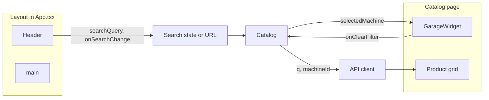

# B2B Agro-Brutalism UI Components

## Current state

- **Frontend:** [frontend/](frontend/) — Vite + React 18 + TS; **Tailwind and lucide-react are not installed**; no `components/` folder.
- **Layout:** Top nav is inline in [frontend/src/App.tsx](frontend/src/App.tsx) (green bar, links, no search/cart badge).
- **Catalog:** [frontend/src/pages/Catalog.tsx](frontend/src/pages/Catalog.tsx) renders products as plain `<li>` with name, article_number, price, status; has local `q` and `machineId` state and a simple search input + machine select.
- **API types:** [frontend/src/api/client.ts](frontend/src/api/client.ts) defines `Product` (including `article_number`, `status`, `price`), `Machine` (`brand`, `model`, `year`), `ProductList`. Cart is fetched via raw `fetch("/api/cart")` in Cart.tsx; no cart-count endpoint in client.

## Prerequisites: Tailwind + lucide-react

- **Install:** `tailwindcss`, `postcss`, `autoprefixer`, `lucide-react` in `frontend/`.
- **Config:** Add `tailwind.config.js` (content: `./index.html`, `./src/**/*.{js,ts,jsx,tsx}`) and `postcss.config.js` in `frontend/`.
- **Styles:** In [frontend/src/index.css](frontend/src/index.css), add Tailwind directives and set base font to strict sans (e.g. `font-sans`); keep `bg-gray-50` for app background (replace current `#f5f5f5` via Tailwind or a wrapper class).
- **Body/root:** Use `min-h-screen` and `bg-gray-50` on the app wrapper so the design system backgrounds apply.

No design tokens beyond Tailwind defaults are required; the spec uses standard Tailwind classes (`emerald-800`, `amber-500`, `slate-900`, etc.).

---

## 1. Header component

**File:** `frontend/src/components/Header.tsx`

- **Structure:** White bar (`bg-white`), sharp/subtle border (`border-b border-gray-200`), padding to meet min touch targets (e.g. `min-h-12`), flex layout.
- **Left:** Logo/title link “Агро Маркетплейс” (or site name) to `/` — `text-emerald-800 font-bold`.
- **Center:** Large search input — full-width on small screens, max-width on larger (e.g. `max-w-xl`), placeholder: “Search by Article or Name...”, `rounded-md border border-gray-200`, `min-h-12`. Controlled via props: `searchQuery`, `onSearchChange`; optional `onSearchSubmit` to sync with URL (e.g. navigate to `/catalog?q=...`).
- **Right:** Language toggle (RU | KZ) — buttons or pills, one active (e.g. `bg-emerald-800 text-white` for active, `text-slate-500` for inactive); props: `lang: 'ru' | 'kz'`, `onLangChange`. Then cart link with icon (lucide-react `ShoppingCart`) and badge showing count; prop `cartItemCount: number` (default 0). Then existing auth/nav block: Каталог, Мой Гараж, Корзина, Заказы, Вход/Выйти — styled as text links `text-slate-700` / `text-emerald-800` for current, no green bar so the bar stays white.
- **Props interface:**  
`searchQuery: string`, `onSearchChange: (v: string) => void`, `cartItemCount?: number`, `lang: 'ru' | 'kz'`, `onLangChange: (lang: 'ru' | 'kz') => void`, plus auth-related props (user, logout, etc.) or children for the right-side nav so Layout can pass them without duplicating auth logic.

**Integration:** Replace the current `<nav>` in `Layout` in [frontend/src/App.tsx](frontend/src/App.tsx) with `<Header ... />`. Lift search state to Layout (or use `useSearchParams` in Header and read `q` in Catalog from URL). Cart count: Layout can pass a count from a small custom hook that fetches `/api/cart` when `user` is set and returns `items.length` (or sum of quantities), or pass `0` until wired.

---

## 2. ProductCard component

**File:** `frontend/src/components/ProductCard.tsx`

- **Data:** Accept `Product` from [frontend/src/api/client.ts](frontend/src/api/client.ts) (or a minimal subset: `id`, `name`, `article_number`, `price`, `status`, `images`). Optional `compatibleWithGarage?: boolean` for the compatibility badge.
- **Layout:** Card with `bg-white border border-gray-200 rounded-md shadow-sm`, padding. Image (if `images?.[0]`) — small, not dominant (e.g. fixed height ~80–100px, object-cover), so B2B data is focus.
- **Top:** Part number (SKU): `text-lg font-mono font-bold text-slate-700`. Below: product name (title).
- **Stock:** From `status`: if `status === 'In_Stock'` — green dot + “In Stock”; else (e.g. `On_Order`) — yellow dot + “On Order”. Use lucide-react dot or a small `rounded-full` div; text `font-semibold`.
- **Compatibility:** When `compatibleWithGarage === true`, show a green badge: “✅ Compatible with your Garage” (or similar), `bg-emerald-100 text-emerald-800 rounded-md` / small padding.
- **Bottom:** Price — large, bold (`text-slate-900 font-bold`). CTA: full-width button “Add to Cart” — `bg-amber-500 hover:bg-amber-600` with `min-h-12`, `rounded-md`. Optional `onAddToCart?: (productId: number) => void`; wrap card content in `Link` to product page where applicable, but keep button as button (stop propagation if needed).
- **Typography:** Strict sans only (`font-sans`), no thin weights; prices/SKU as specified.

**Integration:** In [frontend/src/pages/Catalog.tsx](frontend/src/pages/Catalog.tsx), replace the current `<li>` product list with a grid of `<ProductCard key={p.id} product={p} compatibleWithGarage={!!machineId} onAddToCart={...} />`. `onAddToCart` can call existing cart API (e.g. POST to `/api/cart/items`) or be a no-op until wired.

---

## 3. GarageWidget component

**File:** `frontend/src/components/GarageWidget.tsx`

- **Purpose:** Show the currently selected machine used for catalog filtering (e.g. “John Deere 8R 340”) and allow “Add Machine” / “Clear Filter”.
- **Props:**  
`selectedMachine: Machine | null` (from client.ts: `id`, `brand`, `model`, `year`).  
`onClearFilter: () => void`.  
`onAddMachine?: () => void` (e.g. navigate to `/garage`).
- **Design:** Active filter state — border in primary green (`border-emerald-800` or `border-2`), `rounded-md`, `bg-white` or light green tint (`bg-emerald-50`). Display: “Current machine: **John Deere 8R 340**” (brand + model; optionally year). Buttons: “Clear Filter” (secondary, e.g. outline) and “Add Machine” (link or button to garage). Use lucide-react icons (e.g. `Wrench` or `Filter`) for clarity.
- **Placement:** Can be a top banner or a sidebar block. Recommend rendering it above the catalog list when `selectedMachine !== null` (e.g. inside Catalog) so the filter context is clear; optionally also show a compact version in Layout when a machine is selected (e.g. next to Header). No backend changes — machine selection stays in Catalog state (or URL) as today.

**Integration:** In Catalog, when `machineId` is set, resolve the selected machine from `machines` (already loaded) and render `<GarageWidget selectedMachine={machine} onClearFilter={() => setMachineId('')} onAddMachine={() => navigate('/garage')} />` above the product grid. If search is moved to Header, Catalog still keeps `machineId` and machine select could remain on the catalog page or move into the widget area.

---

## Data flow summary

- **Search:** Header controls search; Catalog reads query from URL (e.g. `useSearchParams`) or from state lifted to Layout.
- **Cart count:** Layout (or a small hook) fetches `/api/cart` when user is logged in and passes `cartItemCount` to Header.
- **ProductCard:** Receives `Product` and optional `compatibleWithGarage`; Catalog sets `compatibleWithGarage={!!machineId}` when filtering by machine.
- **GarageWidget:** Receives selected `Machine` from Catalog’s `machines` + `machineId`; callbacks update Catalog state or navigate.

---

## File checklist

| Action                                              | Path                                                                                 |
| --------------------------------------------------- | ------------------------------------------------------------------------------------ |
| Add deps + Tailwind/PostCSS config                  | `frontend/package.json`, `frontend/tailwind.config.js`, `frontend/postcss.config.js` |
| Tailwind directives + base styles                   | `frontend/src/index.css`                                                             |
| Create component                                    | `frontend/src/components/Header.tsx`                                                 |
| Create component                                    | `frontend/src/components/ProductCard.tsx`                                            |
| Create component                                    | `frontend/src/components/GarageWidget.tsx`                                           |
| Use Header + optional cart hook                     | `frontend/src/App.tsx` (Layout)                                                      |
| Use ProductCard + GarageWidget, sync search/machine | `frontend/src/pages/Catalog.tsx`                                                     |

---

## Wiring notes (no backend work)

- **Cart count:** Either a `useCartCount()` hook that fetches `GET /api/cart` and returns `items.length`, or pass `0` to Header until you add the hook.
- **Search:** Prefer `useSearchParams` in Header (or in Layout) so the catalog URL is `/catalog?q=...`; Catalog already has `q` state — switch to reading initial `q` from URL and syncing on change.
- **Add to Cart:** ProductCard’s `onAddToCart(productId)` can be implemented in Catalog by calling `fetch('/api/cart', { method: 'POST', body: JSON.stringify({ product_id, quantity: 1 }), ... })` with auth header; exact endpoint from your backend (Cart.tsx uses GET/DELETE; POST for add is typical).
- **Language (RU/KZ):** UI only; store choice in state or localStorage and pass to Header; no API change.

All components will use **Tailwind only** (no inline styles for layout/colors), **lucide-react** for icons, and **TypeScript** interfaces that align with [frontend/src/api/client.ts](frontend/src/api/client.ts).