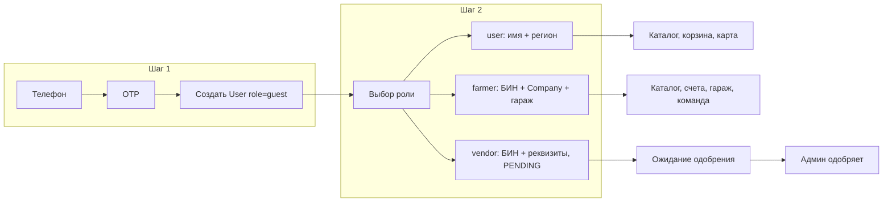

# Прогрессивный онбординг B2B-маркетплейса

## Текущее состояние

- **Auth:** телефон + OTP ([backend/app/routers/auth.py](backend/app/routers/auth.py)); при первом входе создаётся пользователь с `role=farmer` по умолчанию.
- **User:** [backend/app/models/user.py](backend/app/models/user.py) — роли `guest`, `farmer`, `vendor`, `admin`; поля `phone`, `name`, `company_details` (JSONB); нет `company_id`, нет роли «обычный пользователь», нет статуса одобрения поставщика.
- **Frontend:** только [Login](frontend/src/pages/Login.tsx) (телефон → код → редирект в каталог); нет страниц онбординга и выбора роли.
- **Garage:** уже есть ([backend/app/models/garage.py](backend/app/models/garage.py), роутер `/garage`); используется в рекомендациях и ТО.

---

## Целевая архитектура

- **Единая точка входа:** все входят по номеру телефона + OTP; паролей нет.
- **После первого входа:** пользователь с `role=guest` попадает на экран выбора роли; после выбора и заполнения минимальных данных роль меняется на `user` / `farmer` / `vendor` и доступ открывается по сценарию.
- **Роли не мешают друг другу:** разграничение через `User.role` и (для vendor) статус компании; доступ к маршрутам — через существующие `RequireAuth` / `RequireRole` с учётом `guest` и статуса поставщика.

---

## 1. Изменения в БД и моделях (backend)

### 1.1 Роли

- В [backend/app/models/user.py](backend/app/models/user.py) добавить роль `**user**` (обычный пользователь: механик, частник).
- Трактовка `**guest**`: пользователь прошёл только шаг 1 (телефон + OTP), роль ещё не выбрана. При `verify_otp` создавать пользователя с `role=guest`, а не `farmer`.

Итог: `UserRole`: `guest` | `user` | `farmer` | `vendor` | `admin`.

### 1.2 Таблица Company

- Новая модель и таблица `**companies**`:
  - `id`, `bin` (unique, индекс), `name`, `legal_address`, `chairman_name` (из API или ручной ввод),
  - `bank_iik`, `bank_bik` (nullable — для поставщиков),
  - `status`: enum `PENDING_APPROVAL` | `APPROVED` (для vendor; для farmer можно сразу `APPROVED` или отдельный флаг «это фермерская компания»),
  - `created_at`, `updated_at`.
- В **User** добавить `company_id` (FK на `companies`, nullable). Связь: один пользователь — одна компания; у компании — много пользователей (фермер + механики).

Миграция: новая Alembic-миграция (новая enum при необходимости, создание `companies`, добавление `company_id` в `users`, добавление значения `user` в enum `userrole` если его ещё нет в БД).

### 1.3 Поля User под онбординг

- **region** (nullable string) — для роли `user`: регион для доставки (например, «Карагандинская область»). Можно хранить в JSONB `profile` или отдельной колонкой.
- **Vendor-одобрение:** доступ к vendor-функциям проверять по `User.role == vendor` и `User.company.status == APPROVED` (или по полю на User, если решите хранить статус там). Если компания в `PENDING_APPROVAL` — возвращать 403 с сообщением «Ожидайте одобрения заявки».

---

## 2. Бэкенд: API и сервисы

### 2.1 Создание пользователя при verify_otp

- В [backend/app/routers/auth.py](backend/app/routers/auth.py) в `verify_otp`: при создании нового пользователя задавать `role=UserRole.guest` вместо `farmer`.

### 2.2 Онбординг (выбор роли и доп. данные)

- **Вариант A:** отдельный роутер `POST /auth/onboarding` (или `PATCH /auth/me/onboarding`) — принимает выбранную роль и тело в зависимости от роли:
  - **user:** `{ "role": "user", "name": "...", "region": "..." }`.
  - **farmer:** `{ "role": "farmer", "bin": "...", "name": "..." }` — создаётся/находится Company (по БИН), подтягиваются данные из BIN API если настроен, User обновляется (name, company_id, role).
  - **vendor:** `{ "role": "vendor", "bin": "...", "bank_iik": "...", "bank_bik": "...", "contact_name": "...", ... }` — создаётся Company со статусом `PENDING_APPROVAL`, User привязывается к компании, role=vendor.
- **Вариант B:** разбить на несколько вызовов (например, сначала `PATCH /auth/me` с role, затем отдельно «заполнить компанию» для farmer/vendor). Для простоты и атомарности предпочтителен один шаг онбординга (вариант A).
- Ограничение: вызывать onboarding может только пользователь с `role=guest`; после успешного вызова роль меняется и повторный вызов отклонять.

### 2.3 Поиск по БИН (BIN lookup)

- Сервис в backend (например, `app/services/bin_lookup.py`): вызов внешнего API (Adata.kz или аналог) по БИН; возврат структуры: название юр. лица, юридический адрес, ФИО руководителя.
- Конфиг: `ADATA_API_KEY` (или аналогичный) в [backend/app/config.py](backend/app/config.py) и в `.env`; при отсутствии ключа или ошибке API — не падать, а разрешать ручной ввод (поля остаются пустыми/заполняются пользователем).
- Эндпоинт: `GET /auth/bin-lookup?bin=...` (или включить вызов в один запрос onboarding для farmer/vendor). Защита: только для аутентифицированных; лимит запросов по БИН (например, 20/день на пользователя) если используете бесплатный тариф Adata.

**Обязательный fallback (риск 1 — Adata «упал» или лимит исчерпан):** Регистрация фермера/поставщика не должна зависеть от доступности BIN API. При любом сбое (API недоступен, таймаут, 429/лимит, нет ключа) — **не возвращать 500 и не блокировать онбординг**. Варианты реализации: (1) эндпоинт BIN lookup возвращает 200 с пустыми полями и флагом `manual_input_required: true`, либо (2) ловить исключения в сервисе и возвращать пустой результат. На фронте: если ответ пустой или ошибка — показывать обычные поля для ручного ввода (Название компании, Юридический адрес, ФИО руководителя) и разрешать отправить onboarding без данных из API. Итог: пользователь всегда может зарегистрироваться, даже при полном отказе Adata.

Справка: Adata.kz даёт API и бесплатный лимит (порядка 20 запросов/день); stat.gov.kz для BIN-поиска может требовать личный кабинет — предпочтительно заложить один провайдер (Adata) с fallback на ручной ввод.

### 2.4 Ограничение доступа vendor по статусу

- В [backend/app/dependencies.py](backend/app/dependencies.py): `get_current_vendor` дополнительно проверять, что у пользователя компания в статусе `APPROVED` (или что у User нет требования «ожидать одобрения»). Если роль vendor, но компания `PENDING_APPROVAL` — возвращать 403 с понятным сообщением («Заявка на поставщика на рассмотрении»).

### 2.5 Админка: одобрение поставщиков

- В [backend/app/routers/admin.py](backend/app/routers/admin.py) добавить:
  - `GET /admin/vendors/pending` — список заявок (пользователи с role=vendor и company.status=PENDING_APPROVAL) с полями компании и контактами.
  - `POST /admin/vendors/{company_id}/approve` и, при необходимости, `POST /admin/vendors/{company_id}/reject` — смена статуса компании на `APPROVED` / отклонение (отдельный статус или удаление — по желанию).

---

## 3. Frontend

### 3.1 Редирект после входа: гость → онбординг

- В [frontend/src/pages/Login.tsx](frontend/src/pages/Login.tsx) после успешного `verify_otp` (и после `login(token)`) не сразу вызывать `goAfterLogin()`, а:
  - запросить `GET /auth/me` (или дождаться обновления `user` из `useAuth`),
  - если `user.role === "guest"` — редирект на `/onboarding`,
  - иначе — редирект как сейчас (from ?? `/catalog`).
- Альтернатива: централизовать логику в роутере — маршрут `/onboarding` с guard: если авторизован и `role !== "guest"`, редирект в каталог; для защищённых маршрутов (cart, orders, garage, vendor, admin) если `role === "guest"` — редирект на `/onboarding`. Так «единая точка входа» и «обязательный выбор роли» не конфликтуют с просмотром каталога (гостю можно разрешить только каталог до выбора роли, а корзину/заказы — после).

### 3.2 Страница онбординга

- Новая страница **Onboarding** (например, [frontend/src/pages/Onboarding.tsx](frontend/src/pages/Onboarding.tsx)):
  - Шаг 1: «Как вы планируете использовать платформу?» — три карточки: Обычный пользователь / Фермер (КХ, ТОО) / Поставщик.
  - Шаг 2 (в зависимости от выбора):
    - **user:** форма «Имя», «Регион» (текстовое поле или выпадающий список областей РК); отправка `POST /auth/onboarding` с `{ role: "user", name, region }`.
    - **farmer:** поле БИН → по кнопке «Проверить» вызывать BIN lookup; при успехе — подставить название, адрес, руководитель; при ошибке или пустом ответе (API недоступен/лимит) — показать те же поля для ручного ввода и не блокировать продолжение. Кнопка «Продолжить» → отправка onboarding с созданием/привязкой компании; затем опционально CTA «Добавить технику в Гараж» (редирект на `/garage` или модальное окно).
    - **vendor:** форма БИН, банковские реквизиты (ИИК, БИК), контакт ответственного; BIN lookup по желанию; отправка onboarding → сообщение «Заявка отправлена. Ожидайте одобрения администратора».
- После успешной отправки — обновить данные пользователя (перезапрос `/auth/me` или обновление контекста), редирект в каталог (или для vendor — на страницу «Статус заявки»).

### 3.3 Роутинг и охрана маршрутов

- Добавить маршрут `/onboarding` в [frontend/src/App.tsx](frontend/src/App.tsx); обернуть в `RequireAuth`; внутри страницы или в общем guard: если `user.role !== "guest"` — редирект на `/catalog`.
- В `RequireAuth`: для гостя — **не** редиректить с `/cart` на `/onboarding` при простом заходе на страницу корзины (гость может просматривать корзину и добавлять товары). Редирект на `/onboarding` — только при попытке перейти на `/orders`, `/garage`, `/vendor/*`, `/admin` или при нажатии «Оформить заказ» (см. семантика guest ниже).
- Для vendor: если роль vendor, но компания не одобрена — при заходе на `/vendor` и `/vendor/products` показывать экран «Заявка на рассмотрении» вместо контента (бэкенд уже отдаёт 403; на фронте можно показывать дружелюбную страницу по коду ответа или по полю в `GET /auth/me`, например `company_status: "pending"`).

### 3.4 Типы и API

- В [frontend/src/api/client.ts](frontend/src/api/client.ts): расширить тип `User` полями `region?`, `company_id?`, при необходимости `company_status?` для vendor.
- Добавить вызовы: onboarding (POST), BIN lookup (GET), при необходимости — «мой статус поставщика».

---

## 4. Как роли и сценарии не мешают друг другу

| Действие                       | guest                    | user | farmer | vendor (pending) | vendor (approved) | admin |
| ------------------------------ | ------------------------ | ---- | ------ | ---------------- | ----------------- | ----- |
| Просмотр каталога              | да                       | да   | да     | да               | да                | да    |
| Корзина (просмотр, добавление) | да (localStorage или БД) | да   | да     | блок             | да                | да    |
| Оформить заказ                 | редирект → /onboarding   | да   | да     | блок             | да                | да    |
| Заказы, гараж, счета           | нет → /onboarding        | да   | да     | блок             | да                | да    |
| Счета, команда (фермер)        | нет                      | нет  | да     | —                | —                 | да    |
| Загрузка прайсов, товары       | нет                      | нет  | нет    | блок «ожидайте»  | да                | да    |
| Одобрение поставщиков          | нет                      | нет  | нет    | нет              | нет               | да    |

- **Единая точка входа:** только телефон + OTP; пароль только в demo.
- **Минимальные данные на первом шаге:** только телефон; имя, регион, БИН, реквизиты — только после выбора роли.
- **Автоматизация:** БИН → подстановка названия и адреса через API; при недоступности API — ручной ввод.
- **Безопасность маркетплейса:** поставщики создаются со статусом `PENDING_APPROVAL`; доступ к vendor-разделу только после одобрения админом.

### 4.1 Риски и митигации (обязательно для реализации)

| Риск                                     | Требование к реализации                                                                                                                                                                                                 |
| ---------------------------------------- | ----------------------------------------------------------------------------------------------------------------------------------------------------------------------------------------------------------------------- |
| **Adata упал / лимит исчерпан**          | Никогда не возвращать 500 и не блокировать регистрацию по БИН. При недоступности BIN API показывать поля ручного ввода (название компании, адрес, руководитель) и разрешать завершить онбординг.                        |
| **Жёсткая блокировка корзины для гостя** | Гостю разрешить добавлять в корзину и просматривать её (localStorage или БД). Блокировать только действие «Оформить заказ» — в этот момент редирект на `/onboarding` (выбор роли), затем привязка корзины и оформление. |

---

## 5. Рекомендации по улучшению (из практик и исследования)

- **Лимиты и кэш BIN:** кэшировать ответы BIN lookup по БИН (Redis или БД) на 24–48 часов, чтобы уложиться в лимит Adata (20 запросов/день на бесплатном плане) и ускорить повторные вводы.
- **Регионы:** завести справочник областей РК (таблица или константа в коде) для выпадающего списка у роли `user` и при необходимости для доставки.
- **Гараж после выбора «фермер»:** не блокировать онбординг при отказе «добавить технику сейчас» — показать CTA один раз и дать ссылку «Мой гараж» в шапке.
- **Семантика guest (риск 2 — не блокировать продажи):** Гостю **разрешить** добавлять товары в корзину и просматривать её (корзина хранится в localStorage и/или в БД по `user_id` гостя). **Не блокировать** доступ к странице корзины. В момент нажатия «Оформить заказ» — редирект на `/onboarding` (выбор роли: Обычный пользователь / Фермер). После прохождения онбординга — привязка/слияние корзины с пользователем и возможность оформить заказ. Так мотивация заполнить профиль максимальна (уже выбрал товары), без раздражения от блокировки корзины.
- **Демо-аккаунты:** в seed оставить админа и при необходимости фермера с уже выбранной ролью (не guest), чтобы не ломать текущие сценарии тестирования.

---

## 6. Порядок внедрения (кратко)

1. Backend: модель Company, миграция (companies + user.company_id + role user), обновление User (region или profile).
2. Backend: verify_otp создаёт guest; эндпоинт onboarding (PATCH/POST) и BIN lookup сервис + эндпоинт; зависимости vendor с проверкой статуса компании; админские эндпоинты pending/approve.
3. Frontend: страница Onboarding (выбор роли + формы по ролям), редиректы guest → /onboarding и охрана маршрутов; расширение User типа и вызовы API; экран «Ожидайте одобрения» для vendor pending.
4. Конфиг и документация: ADATA_API_KEY, описание шагов онбординга для поддержки и тестов.

