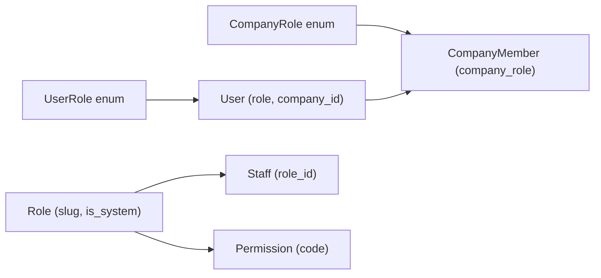

# Модель ролей и прав доступа

Документ описывает архитектуру ролей, токены, зависимости авторизации, карту роутов и рекомендации по тестированию и рискам.

---

## 1. Обзор архитектуры ролей

### 1.1 Две подсистемы

В проекте используются **две независимые подсистемы** авторизации:

| Подсистема | Сущность | Роль/права | Назначение |
|------------|----------|------------|------------|
| **Маркетплейс** | `User` | `UserRole` (один на пользователя) | Покупатели, фермеры, поставщики, админ маркетплейса |
| **Staff (бэк-офис)** | `Staff` | `Role` → множество `Permission` | Сотрудники поддержки/админки с гранулярными правами |

Связь: админ-панель (`/admin/*`) принимает **либо** маркетплейс-админа (`User.role == admin`), **либо** staff с нужным permission через гибридную зависимость `require_admin_or_staff(permission_code)`.

### 1.2 Модели и перечисления

**UserRole** ([backend/app/models/user.py](backend/app/models/user.py)):

| Значение | Описание |
|----------|----------|
| `guest` | Гость, ещё не прошёл onboarding (выбор роли) |
| `user` | Обычный пользователь (покупатель) |
| `farmer` | Фермер (доступ к гаражу и т.п.) |
| `vendor` | Поставщик (товары, заказы, команда компании) |
| `admin` | Администратор маркетплейса (полный доступ к админке и обход farmer/vendor) |

**CompanyRole** ([backend/app/models/company_member.py](backend/app/models/company_member.py)) — роль пользователя **внутри компании поставщика** (только для `User.role == vendor` и при наличии `company_id`):

| Значение | Описание |
|----------|----------|
| `owner` | Владелец компании (управление командой, приглашения) |
| `manager` | Менеджер |
| `warehouse` | Склад |
| `sales` | Продажи |

**Staff:** [backend/app/models/staff.py](backend/app/models/staff.py)

- **Permission**: `id`, `code` (строка, например `users.view`), `name`.
- **Role**: `id`, `name`, `slug`, `is_system`; связь many-to-many с `Permission` через таблицу `role_permissions`.
- **Staff**: `id`, `login`, `password_hash`, `role_id` → `Role`, `is_active`.

Системные роли staff (миграция 008): `super_admin`, `admin`, `support`. Роль с `slug == "super_admin"` обходит проверки по конкретным permissions.

### 1.3 Схема сущностей

---

## 2. Токены и аутентификация

### 2.1 Маркетплейс (User)

**Файл:** [backend/app/services/auth/tokens.py](backend/app/services/auth/tokens.py)

- **Access token**: создаётся `create_access_token(user_id, role: UserRole, phone, client_ip?)`.
  - Поля: `sub` (user_id), `role`, `phone`, `iat`, `exp`, `iss: "marketplace"`, `jti`.
  - Опционально: `ip_hash` при `jwt_bind_ip`.
  - Срок жизни: `settings.jwt_access_expire_minutes`.
- **Refresh token**: `create_refresh_token(user_id, role, phone)` — тот же `role`, отдельный секрет (`jwt_refresh_secret`), тип `refresh`, срок — `jwt_refresh_expire_days`.

Роль в JWT используется только для удобства; при каждом запросе пользователь загружается из БД по `sub`, и проверки идут по `current_user.role` и связанным данным (company, company_membership).

### 2.2 Staff (бэк-офис)

**Файл:** [backend/app/routers/staff.py](backend/app/routers/staff.py) — функции `_create_staff_token`, `_create_staff_refresh_token`.

- **Access token**: `sub` (staff_id), `permissions` (список кодов), `iat`, `exp`, `iss: "staff-portal"`, `jti`. Секрет: `staff_jwt_secret` или `jwt_secret`.
- **Refresh token**: без `permissions`; при обновлении права снова подставляются из БД (роль staff и её permissions).

Проверки прав на бэкенде всегда используют **права из БД** (staff.role.permissions), а не из JWT; JWT лишь кэширует список для удобства.

### 2.3 Отличия контуров

| Параметр | Marketplace | Staff |
|----------|--------------|-------|
| Issuer | `marketplace` | `staff-portal` |
| Секрет | `jwt_secret` | `staff_jwt_secret` или `jwt_secret` |
| В токене | `role` (UserRole) | `permissions` (list[str]) |
| Источник прав | User.role из БД | Staff.role.permissions из БД |

---

## 3. Зависимости авторизации (бэкенд)

**Файл:** [backend/app/dependencies.py](backend/app/dependencies.py)

### 3.1 Маркетплейс (User)

| Зависимость | Условие допуска |
|-------------|------------------|
| `get_current_user_optional` | Декодирует JWT (issuer `marketplace`), опционально IP, чёрный список; загружает User с company и company_membership; выставляет `SET LOCAL app.current_user_id` для RLS. Возвращает `User \| None`. |
| `get_current_user` | Требует результат `get_current_user_optional` не None, иначе 401. |
| `require_role(*roles)` | Требует `current_user.role in roles`. **Не используется** в роутерах; везде используются именованные зависимости ниже. |
| `get_current_farmer` | `UserRole.farmer` или `UserRole.admin`. |
| `get_current_vendor` | `UserRole.vendor` или `UserRole.admin`; для vendor дополнительно проверяется `company.status == APPROVED` (иначе 403 с сообщением об ожидании одобрения). |
| `get_current_vendor_owner` | После `get_current_vendor`: для vendor требуется `company_membership.company_role == CompanyRole.owner`; admin пропускается. |
| `get_current_admin` | Только `UserRole.admin`. |

### 3.2 Staff

| Зависимость | Условие допуска |
|-------------|------------------|
| `get_current_staff` | JWT с issuer `staff-portal`; загрузка Staff с role и role.permissions; staff должен быть `is_active`. |
| `get_current_staff_with_permission(permission_code)` | Staff + (slug == `super_admin` или permission_code в role.permissions). |
| `get_current_staff_with_any_permission(*permission_codes)` | Staff + (slug == `super_admin` или любой из permission_codes в role.permissions). |

### 3.3 Гибрид (админ-панель)

| Зависимость | Условие допуска |
|-------------|------------------|
| `get_current_admin_or_staff(permission_code)` | Сначала проверяется marketplace JWT: если User и `user.role == admin` — возвращается User. Иначе проверяется staff-portal JWT: Staff с данным permission (или super_admin). |
| `require_admin_or_staff(permission_code)` | Обёртка над `get_current_admin_or_staff` для использования в Depends(). |

### 3.4 Ресурсные проверки

| Зависимость | Условие допуска |
|-------------|------------------|
| `get_product_for_vendor(product_id)` | Требует `get_current_vendor`. Доступ: admin; или продукт принадлежит current_user (vendor_id == current_user.id); или продукт принадлежит вендору из той же компании (vendor.company_id == current_user.company_id). Иначе 403. |

---

## 4. Карта роутов и операций по ролям

### 4.1 Auth ([backend/app/routers/auth.py](backend/app/routers/auth.py))

| Операция | Зависимость | Кто имеет доступ |
|----------|-------------|-------------------|
| POST login (OTP/password/demo) | — | Все (анонимно) |
| POST refresh | — | Владелец refresh-токена |
| GET /me | get_current_user | Любой аутентифицированный User |
| PATCH /me, set-password, bin-lookup | get_current_user | Любой аутентифицированный User |
| POST onboarding | get_current_user | Только `role == guest`; после выбора выставляется UserRole (user/farmer/vendor) и при vendor создаётся CompanyMember с CompanyRole.owner |

### 4.2 Admin ([backend/app/routers/admin.py](backend/app/routers/admin.py))

Все эндпоинты используют `require_admin_or_staff(permission_code)`:

| Permission | Примеры эндпоинтов |
|------------|---------------------|
| `users.view` | GET /admin/users, GET /admin/users/{id} |
| `users.edit` | PATCH /admin/users/{id}, блокировка и т.д. |
| `dashboard.view` | GET /admin/dashboard, GET /admin/analytics |
| `vendors.view` | GET /admin/vendors/pending, список поставщиков |
| `vendors.approve` | POST approve/reject поставщика |
| `feedback.view` | Список обращений, детали тикета |
| `feedback.edit` | PATCH статус/приоритет/категория, ответы |
| `orders.view` | GET /admin/orders, GET /admin/orders/{id} |
| `search.view` | GET /admin/search |
| `audit.view` | GET /admin/audit |

### 4.3 Staff ([backend/app/routers/staff.py](backend/app/routers/staff.py))

| Операция | Зависимость | Кто имеет доступ |
|----------|-------------|-------------------|
| POST login, refresh | — | По логину/паролю staff |
| GET /me | get_current_staff | Любой активный staff |
| CRUD сотрудников | get_current_staff_with_permission("staff.manage") | Staff с правом staff.manage или super_admin |
| CRUD ролей/прав | get_current_staff_with_permission("roles.manage") или get_current_staff_with_any_permission("roles.manage", "staff.manage") | Соответствующие права или super_admin |

### 4.4 Vendor upload / team ([backend/app/routers/vendor_upload.py](backend/app/routers/vendor_upload.py))

| Операция | Зависимость | Кто имеет доступ |
|----------|-------------|-------------------|
| Загрузка прайса, файлов, склады | get_current_vendor | vendor (с одобренной компанией) или admin |
| Управление командой, приглашения, смена роли | get_current_vendor_owner | vendor-owner или admin |

### 4.5 Orders ([backend/app/routers/orders.py](backend/app/routers/orders.py))

| Операция | Зависимость | Кто имеет доступ |
|----------|-------------|-------------------|
| GET list | get_current_user | Покупатель видит свои заказы (user_id); вендор — свои или компании (vendor_id in company_vendor_ids); админ не переключается на список по user_id (логика: иначе ветка vendor/company). |
| GET /{id} | get_current_user | Покупатель (order.user_id), вендор заказа (order.vendor_id), админ, вендор из той же компании что и order.vendor_id. |
| PATCH /{id}/status | get_current_vendor | Админ или вендор из той же компании, что и заказ. |

### 4.6 Products ([backend/app/routers/products.py](backend/app/routers/products.py))

| Операция | Зависимость | Кто имеет доступ |
|----------|-------------|-------------------|
| GET list (публичный) | get_current_user_optional | Все; при наличии user — для фильтрации/личного. |
| GET /{id} (публичный) | get_current_user_optional | Все. |
| POST (создание) | get_current_vendor | Vendor (одобренный) или admin. |
| PATCH /{id}, POST compatibility | get_current_vendor + get_product_for_vendor | Admin, владелец продукта, вендор той же компании. |
| DELETE /{id} | get_current_admin | Только admin. |

### 4.7 Garage ([backend/app/routers/garage.py](backend/app/routers/garage.py))

Все эндпоинты: `get_current_farmer` — farmer или admin.

### 4.8 Categories, Machines ([backend/app/routers/categories.py](backend/app/routers/categories.py), [backend/app/routers/machines.py](backend/app/routers/machines.py))

Изменение категорий/машин: `get_current_admin`.

### 4.9 Остальные роутеры

- **cart, checkout, notifications**: `get_current_user`.
- **chat, feedback**: `get_current_user_optional` (часть эндпоинтов с обязательным user).
- **recommendations**: `get_current_user_optional`.

---

## 5. Сложные случаи и иерархии

### 5.1 Иерархия маркетплейса

- **admin** может выступать как farmer (get_current_farmer) и как vendor (get_current_vendor), т.е. заходить в зоны фермера и поставщика без смены роли.
- **vendor**: доступ к товарам/заказам ограничен своей компанией (company_id) или своими сущностями (vendor_id == current_user.id).

### 5.2 Staff: super_admin

- Роль с `slug == "super_admin"` в `get_current_staff_with_permission` и `get_current_staff_with_any_permission` всегда допускается без проверки наличия конкретного permission в списке.

### 5.3 Ресурсный доступ

- **Продукт**: `get_product_for_vendor` — admin; владелец продукта (product.vendor_id == current_user.id); вендор той же компании (vendor компании продукта совпадает с current_user.company_id).
- **Заказ**: список и деталь — см. п. 4.5; смена статуса — только вендор той же компании или admin.
- **RLS**: в миграции 023 для таблиц `orders`, `notifications`, `cart_items`, `feedback_tickets` политика использует `current_setting('app.current_user_id')::int = user_id`. Переменная `app.current_user_id` выставляется в `get_current_user_optional` (или -1 при отсутствии пользователя). Важно: приложение должно работать под ролью БД, которая **не** владелец таблиц (иначе RLS можно обойти).

---

## 6. Staff: permission-коды и использование

**Миграция:** [backend/alembic/versions/008_staff_roles_permissions.py](backend/alembic/versions/008_staff_roles_permissions.py)

Коды прав:

- `dashboard.view`, `orders.view`, `orders.edit`, `vendors.view`, `vendors.approve`, `feedback.view`, `feedback.edit`, `users.view`, `users.edit`, `audit.view`, `search.view`, `staff.manage`, `roles.manage`

Системные роли:

- **super_admin**: все перечисленные права (фактически проверка по slug).
- **admin**: все кроме `staff.manage`, `roles.manage`.
- **support**: `feedback.view`, `feedback.edit`, `search.view`.

Все перечисленные коды используются в `require_admin_or_staff(...)` или в staff-роутере (`get_current_staff_with_permission` / `get_current_staff_with_any_permission`); неиспользуемых кодов в коде нет. Новые права при добавлении эндпоинтов нужно явно привязывать к зависимостям.

---

## 7. Фронтенд: использование ролей и прав

### 7.1 Данные пользователя (маркетплейс)

- **Источник:** GET `/auth/me`, ответ содержит `role`, `company_status`, `company_role` и др.
- **Хранение:** [frontend/src/hooks/useAuth.ts](frontend/src/hooks/useAuth.ts) — токен в localStorage, пользователь загружается по токену и сохраняется в state. Тип `User` в [frontend/src/api/types.ts](frontend/src/api/types.ts): `role: string`, `company_role?: string | null`.
- **Защита маршрутов:** `RequireAuth` — редирект на /login если нет user. `RequireRole roles={["admin", "vendor"]}` — редирект на /catalog (или /onboarding для guest), если `user.role` не в списке. Маршруты `/vendor/*` и `/admin` обёрнуты в `RequireRole` с нужными ролями (`admin` для /admin, `admin` и `vendor` для /vendor).
- **Условный рендер:** примеры: `user?.role === "admin"` (Admin.tsx), `user?.role === "vendor" || user?.role === "admin"` (Header, App для токена админки), `user?.company_role === "owner"` для управления командой (VendorTeam), проверка `company_status === "pending_approval"` для блокировки действий вендора.

### 7.2 Staff (бэк-офис)

- **Контекст:** [frontend/src/staff/context/StaffAuthContext.tsx](frontend/src/staff/context/StaffAuthContext.tsx). Хранит `staff` с `role.slug` и `permissions: string[]`. Метод `hasPermission(code)` — true если `slug === "super_admin"` или code в `staff.permissions`.
- **Константа ALL_PERMISSIONS** на фронте совпадает с списком из миграции 008.
- **Маршруты staff:** [frontend/src/staff/routes.tsx](frontend/src/staff/routes.tsx) — `RequireStaffPermission permission="..."` редиректит при отсутствии права. Навигация в бэк-офисе фильтруется по `hasPermission` ([frontend/src/backoffice/navConfig.tsx](frontend/src/backoffice/navConfig.tsx)).

### 7.3 Консистентность с бэкендом

- Строковые значения ролей (`guest`, `user`, `farmer`, `vendor`, `admin`) и коды permissions совпадают с бэкендом. На фронте используются константы из [frontend/src/constants/roles.ts](frontend/src/constants/roles.ts) и [frontend/src/constants/permissions.ts](frontend/src/constants/permissions.ts), синхронизированные с бэкендом.

### 7.4 Доступ staff к админ-панели

Сотрудник (staff) логинится через staff-portal (отдельный эндпоинт логина), получает JWT с `iss: "staff-portal"` и списком permissions. Запросы к API админки (`/admin/*`) принимают либо маркетплейс-токен пользователя с ролью admin, либо staff-токен. На фронте маршрут `/admin` для маркетплейс-пользователя проверяет `user.role === "admin"` и передаёт marketplace-токен; при входе в админку через staff-портал используется staff-токен (на клиенте — `getTokenForAdminApi()`: в demo-режиме может подставляться agro_token, иначе staff-токен). При отсутствии нужного permission бэкенд возвращает 403.

---

## 8. Риски и рекомендации

### 8.1 Выявленные моменты

| Уровень | Описание |
|---------|----------|
| Низкий | `require_role(*roles)` используется в categories и machines для проверки admin; в остальных роутерах — именованные зависимости. |
| Низкий | RLS в 022 изначально был USING (true); в 023 исправлено на проверку `app.current_user_id`. Убедиться, что приложение не запускается от владельца таблиц. |
| Средний | Админ-панель доступна и маркетплейс-админу, и staff с permission. Фронт для /admin проверяет только `user?.role === "admin"` и передаёт marketplace token; если зайти в админку под staff-токеном через отдельный портал/путь, токен для API берётся через `getTokenForAdminApi()` (staff token или в demo — agro_token). Логика согласована. |
| Средний | Удаление продукта только у `get_current_admin`; изменение продукта — у vendor (в т.ч. той же компании). Соответствует бизнес-логике. |

### 8.2 RLS при деплое

- Политики RLS (миграция 023) ограничивают доступ к строкам по `current_setting('app.current_user_id')`. Чтобы политики действовали, приложение должно подключаться к БД **не от имени владельца таблиц** (owner в PostgreSQL обходит RLS). Настройте отдельную роль БД для приложения и выдайте ей только нужные права.

### 8.3 Рекомендации

- Добавить автоматизированные API-тесты на запрет доступа: от имени user/farmer/vendor без прав к эндпоинтам admin, staff, vendor_owner и т.д.
- Держать единый источник прав staff: константы в [backend/app/constants/permissions.py](backend/app/constants/permissions.py) и на фронте в [frontend/src/constants/permissions.ts](frontend/src/constants/permissions.ts). При добавлении новых permission-кодов — см. чеклист ниже.
- Документировать для деплоя: отдельный секрет для staff JWT (`STAFF_JWT_SECRET`), переменные для первого staff-пользователя (миграция 008: `STAFF_DEFAULT_LOGIN`, `STAFF_DEFAULT_PASSWORD`).

### 8.4 Чеклист при добавлении нового permission

1. Добавить константу в [backend/app/constants/permissions.py](backend/app/constants/permissions.py) и при необходимости в `ALL_PERMISSION_CODES`.
2. Использовать константу в зависимостях и роутерах (`require_admin_or_staff`, `get_current_staff_with_permission` и т.д.).
3. При необходимости: миграция или сид для привязки нового права к ролям.
4. На фронте: добавить константу в [frontend/src/constants/permissions.ts](frontend/src/constants/permissions.ts), обновить навигацию staff и маршруты в [frontend/src/staff/routes.tsx](frontend/src/staff/routes.tsx) и [frontend/src/backoffice/navConfig.tsx](frontend/src/backoffice/navConfig.tsx).

---

## 9. Тест-кейсы для ручной/автоматизированной проверки

### 9.1 Маркетплейс (User)

- **guest**: после логина доступен только /onboarding; переход на /orders, /garage, /vendor редиректит на /onboarding или /catalog в зависимости от компонента.
- **user**: каталог, корзина, заказы, профиль; нет доступа к /vendor, /admin, /garage.
- **farmer**: то же + /garage; нет доступа к /vendor, /admin.
- **vendor** (одобренная компания): /vendor, товары, заказы компании; при company_role owner — управление командой и приглашениями.
- **vendor** (pending_approval): фронт ограничивает действия (баннеры); API get_current_vendor возвращает 403 с сообщением об ожидании.
- **admin**: доступ ко всем разделам маркетплейса и к /admin (как маркетплейс-админ).

### 9.2 Staff

- **super_admin**: все разделы бэк-офиса и все permission.
- **admin** (staff): всё кроме управления сотрудниками и ролями (staff.manage, roles.manage).
- **support**: только разделы, требующие feedback.view, feedback.edit, search.view.

### 9.3 Негативные сценарии

- User с ролью user при запросе GET /admin/users с marketplace-токеном — 403 (если бы передал токен) или редирект с фронта. Прямой вызов API с токеном user — 403.
- Vendor без company_role owner при POST приглашения в команду — 403.
- Staff с ролью support при запросе к эндпоинту с require_admin_or_staff("roles.manage") — 403.

---

## 10. Автоматизированные тесты

- В [backend/tests/test_role_access.py](backend/tests/test_role_access.py): тесты на 401 (не-админ → /admin/dashboard) и на 403 (user → /garage/machines, user → POST /products, vendor → POST /categories, vendor не-owner → POST /vendor/team/invite). В [backend/tests/test_orders.py](backend/tests/test_orders.py) проверяется разграничение доступа к заказам по ролям.

---

*Документ составлен по результатам анализа кодовой базы в рамках плана проверки логики ролей.*
